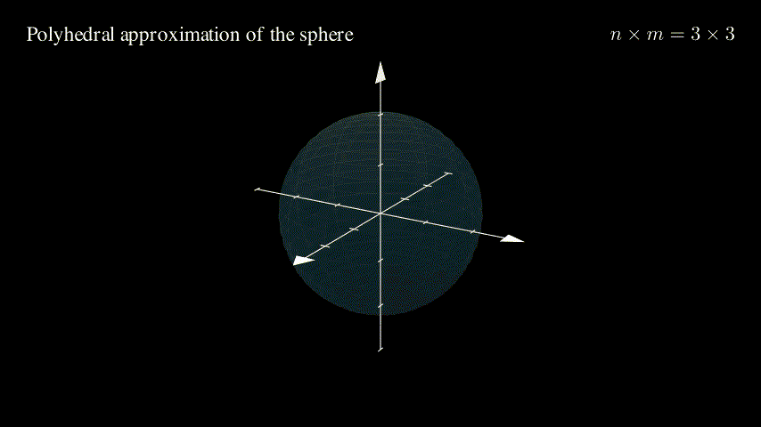

# VF1 Polyhedral Approximation — Manim Visualization

Animations for **§22.3.1 (Stay on a Point / VF1)** from:
> Li, Kapoor & Taylor — *Telerobot Control by Virtual Fixtures for Surgical Applications*

---

## Background

The "stay on a point" virtual fixture keeps the task-frame position close to a target $x_p^d$. The ideal constraint is a sphere:

$$\|\delta_p + \Delta x_p\|^2 \leq \varepsilon_1 \quad \text{(eq. 22.7)}$$

Since this is quadratic, it is replaced by $n \times m$ linear half-spaces (eq. 22.8):

$$\hat{n}_{ij} \cdot (\delta_p + \Delta x_p) \leq \varepsilon_1, \quad i=0\ldots n-1,\; j=0\ldots m-1$$

where the face normals sample the unit sphere on a grid:

$$\hat{n}_{ij} = (\cos\alpha_i\cos\beta_j,\ \cos\alpha_i\sin\beta_j,\ \sin\alpha_i)$$
$$\alpha_i = \frac{i \cdot 2\pi}{n} \quad \text{(latitude)}, \qquad \beta_j = \frac{j \cdot 2\pi}{m} \quad \text{(longitude)}$$

Their intersection is a **polyhedron** that circumscribes the sphere and collapses onto it as $n \times m \to \infty$.

### What are n and m?

| Parameter | Controls | Effect |
|-----------|----------|--------|
| `n` | Number of **latitude** samples (angle $\alpha$) | Adds horizontal rings; changes z-resolution of the polyhedron |
| `m` | Number of **longitude** samples (angle $\beta$) | Adds vertical wedges; changes azimuthal resolution |

Minimum for a **bounded** polyhedron: $3 \times 3$. Minimum for a **symmetric** one: $4 \times 4$.

---

## Scenes

| Scene | Description |
|-------|-------------|
| `VF1Polyhedron` | Target point, error vector $\delta_p$, increment $\Delta x_p$, sphere, and the 12×12 polyhedron |
| `VF1Convergence` | $n \times m$ grows from $3\times3$ to $12\times16$ — polyhedron collapses onto sphere |
| `VF1HalfSpace` | Full polyhedron first, then a single half-space face with outward normal $\hat{n}_{ij}$ |
| `VF1VaryNM` | Vary $n$ alone (fix $m=4$), then $m$ alone (fix $n=4$), then $n=m$ together |

### Convergence: polyhedron → sphere as $n \times m$ grows



---

## Quick start

**Requirements:** Python ≥ 3.12, macOS/Linux.

```bash
# 1. Install system dependencies (macOS)
brew install cairo pkg-config pango ffmpeg

# 2. Clone and install Python packages
git clone <repo-url>
cd <repo>
pip install -r requirements.txt

# 3. Render all four scenes in parallel (low quality preview)
bash render_all.sh
```

Videos are saved to `media/videos/vf1_polyhedron/480p15/`.

## Rendering options

```bash
bash render_all.sh        # low quality MP4 (fast preview)
bash render_all.sh h      # high quality MP4
bash render_all.sh l gif  # low quality GIF
bash render_all.sh h both # high quality MP4 + GIF
```

Single scene:
```bash
manim -pql vf1_polyhedron.py VF1Convergence
```

Quality flags: `l` = 480p15, `m` = 720p30, `h` = 1080p60.

---

## License

MIT — see [LICENSE](LICENSE).
